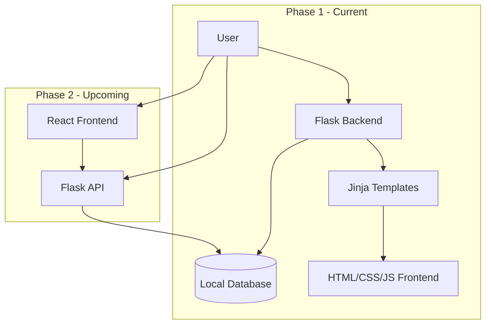
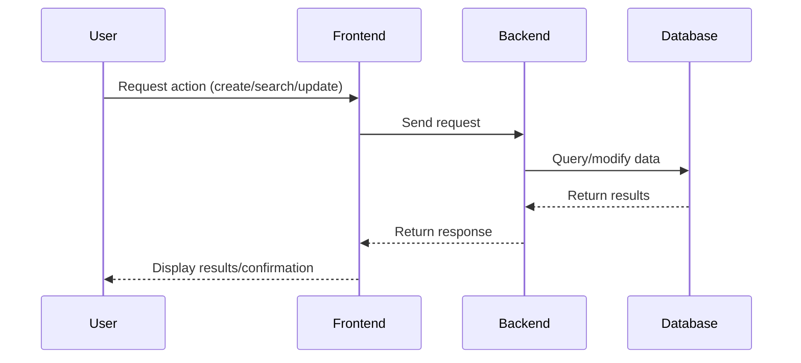
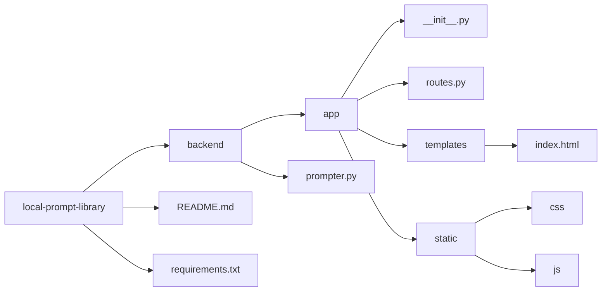

# Local Prompt Library

A locally-hosted tool for saving, managing, and retrieving system prompts for LLMs (Large Language Models).

## Purpose

The Local Prompt Library allows you to create, store, search, update, and retrieve system prompts for various large language models. By storing prompts locally, you maintain full control over your prompt engineering assets and can quickly access them whenever needed.

## Features

### Phase 1 (Current)
- Create and save system prompts
- Search for prompts by keywords or tags
- Update existing prompts
- Basic user interface with Flask, Jinja, HTML, CSS, and minimal JavaScript

### Phase 2 (Upcoming)
- React-based frontend for improved user experience
- Advanced prompt organization with folders and categories
- Prompt version history
- Import/export functionality
- Prompt testing and evaluation tools

## Architecture



## Data Flow



## Project Structure



## Setup and Installation

1. Clone the repository
   ```bash
   git clone https://github.com/username/local-prompt-library.git
   cd local-prompt-library
   ```

2. Create and activate a virtual environment
   ```bash
   python -m venv env
   source env/bin/activate  # On Windows: env\Scripts\activate
   ```

3. Install dependencies
   ```bash
   pip install -r requirements.txt
   ```

4. Run the application
   ```bash
   cd backend
   python prompter.py
   ```

5. Open your browser and navigate to `http://localhost:5000`

## Development Roadmap

### Phase 1: Flask + Jinja + Basic Frontend
- [x] Project setup
- [ ] Database schema design
- [ ] Basic CRUD operations for prompts
- [ ] Simple search functionality
- [ ] Basic UI with Jinja templates
- [ ] Deployment instructions

### Phase 2: React Frontend
- [ ] API development
- [ ] React app setup
- [ ] Advanced UI components
- [ ] Enhanced search and filtering
- [ ] User preferences
- [ ] Prompt categorization and tagging

## Contributing

Contributions are welcome! Please feel free to submit a Pull Request.

## License

This project is licensed under the MIT License - see the LICENSE file for details.
