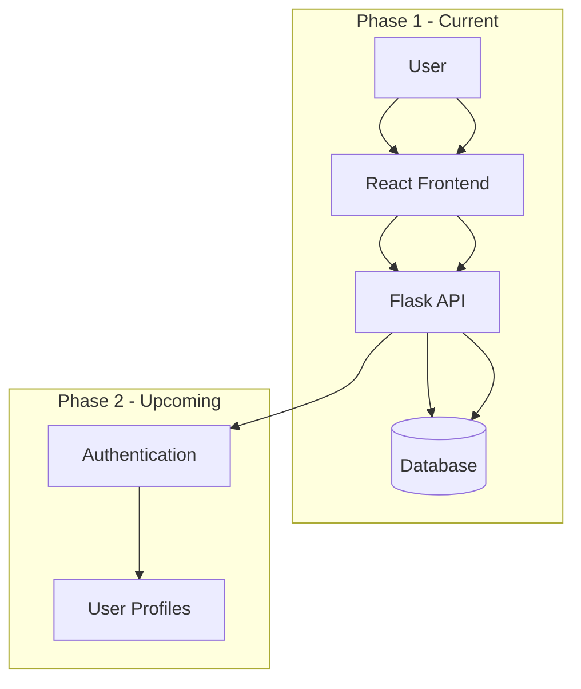
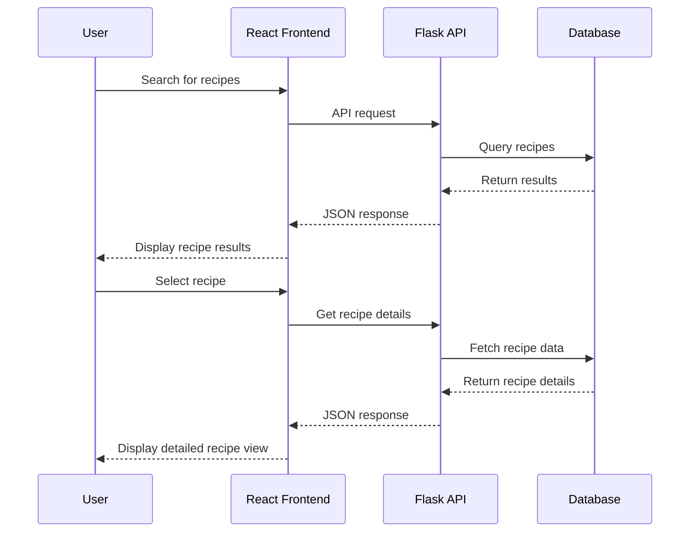
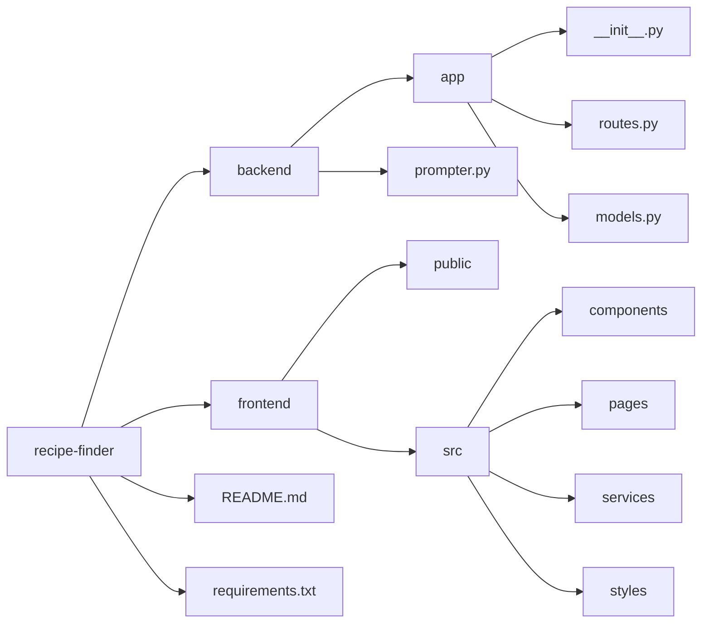

# Recipe Finder

A web application for discovering, searching, and sharing recipes.

## Purpose

Recipe Finder allows users to search for recipes shared by others in the community. The application provides an intuitive interface to browse recipes by categories, ingredients, or cooking time, making it easy to find the perfect meal for any occasion.

## Features

### Phase 1 (Current)
- Search for recipes by name, ingredients, or categories
- View detailed recipe instructions and ingredients
- Browse popular and recently added recipes
- Basic recipe listing and filtering
- Flask backend with API endpoints
- React frontend for modern user experience

### Phase 2 (Upcoming)
- User authentication and profiles
- Personal recipe collections and favorites
- Recipe creation and sharing
- Rating and review system
- Advanced filtering and sorting options
- Social features (following users, sharing recipes)

## Architecture



## Data Flow



## Project Structure



## Setup and Installation

1. Clone the repository
   ```bash
   git clone https://github.com/username/recipe-finder.git
   cd recipe-finder
   ```

2. Backend Setup
   ```bash
   cd backend
   python -m venv env
   source env/bin/activate  # On Windows: env\Scripts\activate
   pip install -r requirements.txt
   python prompter.py
   ```

3. Frontend Setup
   ```bash
   cd ../frontend
   npm install
   npm start
   ```

4. Open your browser and navigate to `http://localhost:3000`

## Development Roadmap

### Phase 1: Core Recipe Search Functionality
- [x] Project setup
- [ ] Database schema design
- [ ] Flask API endpoints for recipe search
- [ ] Basic recipe data model
- [ ] React frontend setup
- [ ] Recipe listing and search components
- [ ] Recipe detail view

### Phase 2: User Accounts and Social Features
- [ ] User authentication system
- [ ] User profiles
- [ ] Recipe creation and management
- [ ] Favorite recipes and collections
- [ ] Social sharing functionality
- [ ] Rating and review system

## Contributing

Contributions are welcome! Please feel free to submit a Pull Request.

## License

This project is licensed under the MIT License - see the LICENSE file for details.
