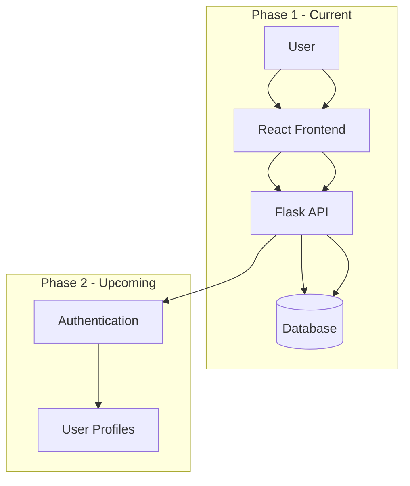
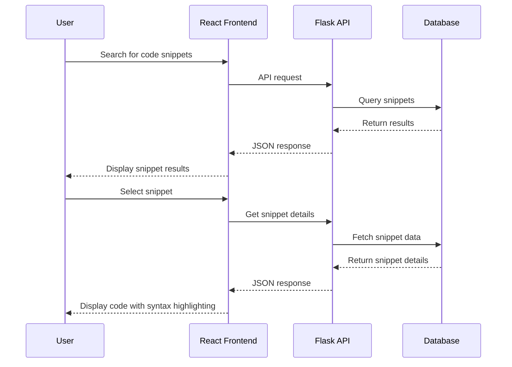
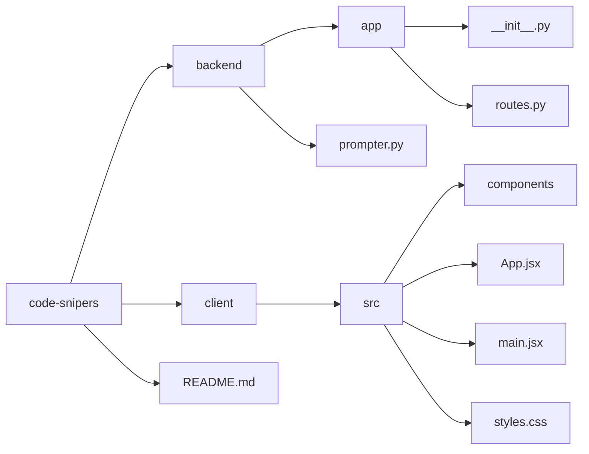

# Code Snipers

A web application for discovering, uploading, and sharing reusable code snippets.

## Purpose

Code Snipers allows users to save and search for reusable code snippets shared by others in the developer community. The application provides an intuitive interface to browse snippets by language, tags, or use case, making it easy to find the perfect code template for any project.

## Features

### Phase 1 (Current)
- Search for code snippets by language, tag, or description
- View detailed code with syntax highlighting and explanations
- Browse popular and recently added snippets
- Basic snippet listing and filtering
- Flask backend with API endpoints
- React frontend for modern user experience

### Phase 2 (Upcoming)
- User authentication and profiles
- Personal snippet collections and favorites
- Snippet creation and sharing
- Rating and comment system
- Advanced filtering and sorting options
- Social features (following users, sharing snippets)

## Architecture



## Data Flow



## Project Structure



## Setup and Installation

1. Clone the repository
   ```bash
   git clone https://github.com/username/code-snipers.git
   cd code-snipers
   ```

2. Backend Setup
   ```bash
   cd backend
   python -m venv env
   source env/bin/activate  # On Windows: env\Scripts\activate
   pip install -r requirements.txt
   python prompter.py
   ```

3. Frontend Setup
   ```bash
   cd ../client
   npm install
   npm run dev
   ```

4. Open your browser and navigate to `http://localhost:5173`

## Development Roadmap

### Phase 1: Core Snippet Functionality
- [x] Project setup
- [ ] Database schema design for code snippets
- [ ] Flask API endpoints for snippet search and retrieval
- [ ] Code snippet data model with language and tag support
- [ ] React frontend setup
- [ ] Snippet listing and search components
- [ ] Syntax highlighting for multiple languages
- [ ] Snippet detail view with copy functionality

### Phase 2: User Accounts and Social Features
- [ ] User authentication system
- [ ] User profiles and dashboards
- [ ] Snippet creation and management
- [ ] Personal snippet collections and favorites
- [ ] Social sharing functionality
- [ ] Rating and comment system
- [ ] Snippet version control

## Contributing

Contributions are welcome! Please feel free to submit a Pull Request.

## License

This project is licensed under the MIT License - see the LICENSE file for details.
